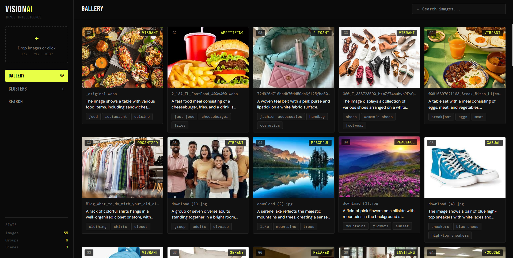
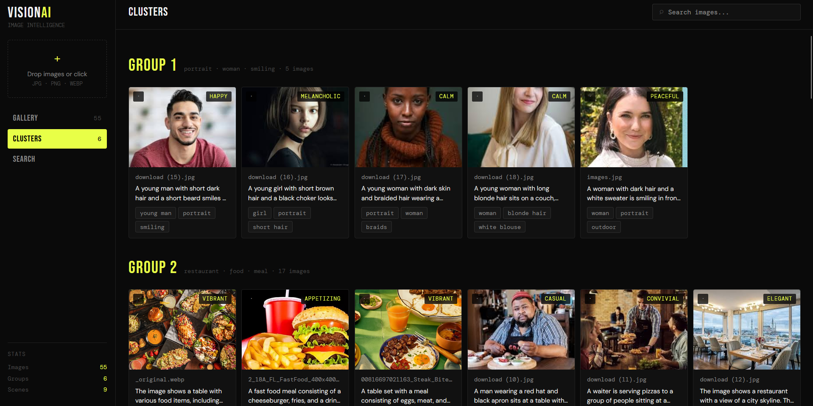
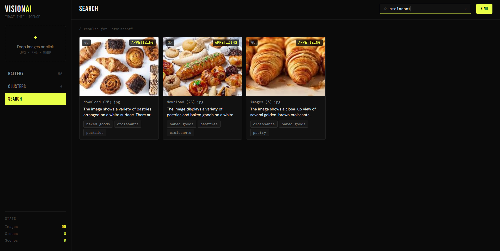

<div align="center">

<br/>



<br/><br/>

# VisionAI

**AI-powered image analysis dashboard, upload images and get automatic descriptions, tags, semantic search, and intelligent clustering.**

[](https://python.org)
[](https://fastapi.tiangolo.com)
[](https://react.dev)
[](https://huggingface.co/openai/clip-vit-base-patch32)
[](LICENSE)

</div>

---

## ✨ Features

- 🖼️ **Auto-analysis** — every uploaded image gets a natural language description, tags, mood, scene type, dominant colors, and time of day via Groq's vision LLM
- 🔍 **Natural language search** — type "croissant", "peaceful lake", or "people outdoors" and find matching images instantly
- 🧠 **Semantic clustering** — images are grouped by meaning, not just visual style, using a hybrid CLIP + text embedding approach
- 📊 **Three views** — Gallery grid, Cluster groups, and Search results
- 🎨 **Detail panel** — click any image for full AI analysis with all metadata
- 🗑️ **Live management** — delete images and clusters re-compute automatically

---

## 🖥️ Screenshots

<div align="center">

### Gallery


<br/><br/>

### Clusters


<br/><br/>

### Search


</div>

---

## 🏗️ Architecture

```
visionai/
├── backend/
│   ├── main.py          # FastAPI server, all API endpoints
│   ├── vision.py        # Groq vision LLM — description, tags, mood
│   ├── clustering.py    # Hybrid CLIP + text embedding + k-means
│   ├── search.py        # Natural language search over descriptions
│   ├── requirements.txt
│   └── .env             # GROQ_API_KEY
│
└── frontend/
    └── index.html       # Full React UI — single file, no build step
```

### How it works

```
Image uploaded
      ↓
Groq LLaMA 4 Scout (vision) → description + tags + mood + scene
      ↓
Two embeddings computed in parallel:
  ├── CLIP ViT-B/32      → 512-dim visual embedding (how it looks)
  └── sentence-transformers → 384-dim text embedding (what it means)
      ↓
Concatenated → 896-dim hybrid feature vector
      ↓
K-means clustering across all images
      ↓
Gallery · Clusters · Search updated live
```

---

## 🧠 The Clustering Story

Getting clustering right took three iterations — each one teaching a real ML lesson.

**v1 — Color histograms**
Simple: extract RGB color distributions per image. Fast, zero dependencies.
Problem: two restaurants with different lighting ended up in different clusters
because their color histograms looked nothing alike.

**v2 — CLIP embeddings only**
CLIP understands visual semantics far better than color — it was trained on
400M image-text pairs. Restaurants clustered together regardless of lighting.
Problem: CLIP is so sensitive to photographic *style* that it split food into
"hero shots" vs "overhead spreads" — grouping pancakes with burgers because
both are centered on a plain background.

**v3 — Hybrid CLIP + text embeddings** ✓
The fix: concatenate CLIP's visual embedding with a text embedding of the
AI-generated description. Now two signals work together:
- CLIP says "these look similar"
- Text says "these mean similar things"

Result: pancakes cluster with breakfast food. Restaurants cluster together
regardless of angle. Portraits form their own group. Much more intuitive.

---

## 🚀 Getting Started

### Prerequisites

- Python 3.11
- Conda (recommended on Windows)
- A free [Groq API key](https://console.groq.com)

### 1. Clone the repo

```bash
git clone https://github.com/yourusername/visionai.git
cd visionai
```

### 2. Create environment

```bash
conda create -n visionai python=3.11
conda activate visionai
```

### 3. Install dependencies

```bash
cd backend
pip install -r requirements.txt
```

> ⏳ First run downloads two models automatically:
> - CLIP ViT-B/32 (~600MB, cached forever after)
> - all-MiniLM-L6-v2 (~80MB, cached forever after)

### 4. Add your Groq API key

Edit `backend/.env`:

```env
GROQ_API_KEY=gsk_your_key_here
```

### 5. Run

```bash
python main.py
```

Open **http://localhost:8000** and start dropping images.

---

## 🔬 Tech Stack

| Component | Technology | Why |
|---|---|---|
| **Vision LLM** | Groq LLaMA 4 Scout | Multimodal model, fast structured JSON output |
| **Visual embeddings** | CLIP ViT-B/32 | Semantic visual understanding, 512-dim |
| **Text embeddings** | all-MiniLM-L6-v2 | Semantic text understanding, 384-dim |
| **Clustering** | scikit-learn K-Means | Simple, effective, no external DB |
| **Search** | Weighted keyword matching | Fast, works on AI-generated descriptions |
| **Backend** | FastAPI | Async, clean REST API |
| **Frontend** | React 18 (no build step) | Single HTML file |

---

## 💡 Things I learned building this

- **Multimodal models** understand both images and text in the same embedding space — CLIP was trained by matching images with their captions, so it learns that a photo of a dog and the word "dog" should be close together.
- **Embeddings capture meaning, not pixels** — two images of the same scene from different angles, with different lighting, will still be close in CLIP's embedding space because they share semantic content.
- **Clustering is sensitive to feature choice** — using raw pixel values or color histograms clusters by appearance. Using CLIP clusters by visual semantics. Using text clusters by content. The best results come from blending both.
- **K-means needs the right k** — too few clusters and everything collapses together, too many and you get singleton groups. The `sqrt(n/2) + 1` heuristic is a practical starting point.
- **LLM output as features** — using the AI-generated description as an embedding input is an elegant trick: you're essentially letting the vision LLM do the semantic parsing, then encoding that understanding into vector form for the clustering algorithm.

---

## 📄 License

MIT

---

<div align="center">
  <sub>Built as Day 3 of a 30-day AI challenge 🚀</sub>
</div>
